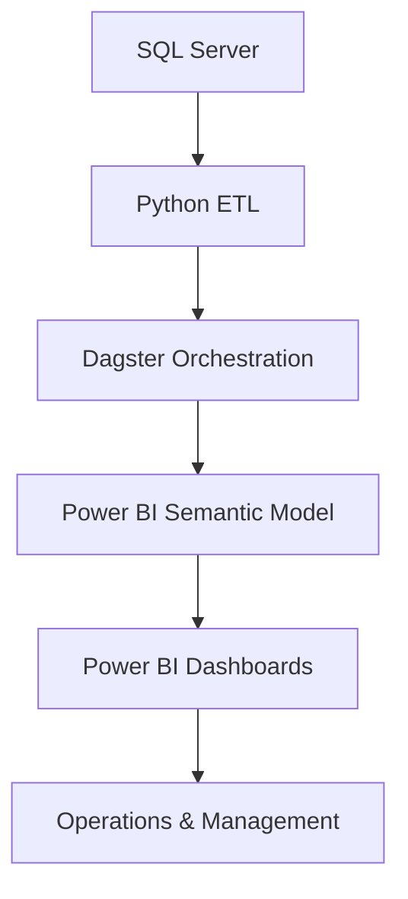

# Customer Service Analytics Platform

Enterprise analytics platform for monitoring customer service operations, SLA compliance, and agent performance through automated ETL pipelines, centralized semantic models, and interactive Power BI dashboards.

---

## Overview

Designed and maintained an enterprise Customer Service Analytics Platform supporting omnichannel customer support operations.

The platform integrates chat sessions, SLA metrics, response times, assignment events, and operational KPIs into centralized Power BI semantic models, enabling real-time operational monitoring for Customer Service teams and management.

Daily ETL pipelines automate data processing and reporting, ensuring reliable KPI tracking and executive reporting.

---

## Business Problem

Customer Service teams required a centralized analytics solution to monitor SLA compliance, response times, and agent productivity across multiple support channels.

Existing reports relied on fragmented datasets and manual processes, making it difficult to identify SLA breaches, monitor operational performance, and provide consistent management reporting.

---

## Solution

Developed an end-to-end analytics platform combining SQL Server, Python ETL pipelines, Dagster orchestration, and Power BI semantic models.

The platform provides:

- SLA monitoring
- First response time analytics
- Assignment time monitoring
- Agent productivity dashboards
- Team performance reporting
- Operational KPI dashboards
- Daily automated reporting

---

## Architecture



---

## Semantic Model Overview

| Metric | Value |
|---------|------:|
| Tables | 32 |
| Measures | 155 |
| Main Measure Table | 136 |
| KPI Measures | 19 |

---

## Business Impact

- Supported operational reporting for more than 100 customer service agents.
- Delivered analytics across 4 customer service teams.
- Maintained weekly and monthly SLA above 99%.
- Automated daily KPI reporting through scheduled ETL pipelines.
- Reduced manual reporting by consolidating operational metrics into centralized dashboards.

---

## Technology Stack

### Data Platform

- SQL Server

### Data Engineering

- Python
- Dagster

### Business Intelligence

- Power BI
- Semantic Models
- DAX

---

## Key Responsibilities

- Designed and maintained enterprise Power BI semantic models.
- Developed SQL transformations supporting operational fact tables.
- Built reusable DAX measures for SLA and operational KPI reporting.
- Developed Python ETL pipelines for daily data processing.
- Automated ETL workflows using Dagster.
- Built dashboards for agents, team leaders, and management.
- Monitored production data quality and reporting reliability.

---

## Repository Structure

```
customer-service-analytics-platform/

├── README.md
│
├── dax/
│   ├── dynamic_sla_engine.dax
│   ├── response_time_metrics.dax
│   └── agent_performance.dax
│
├── sql/
│   ├── backend_order_kpi.sql
│   ├── all_steps.sql
│   ├── session_waiting_duration.sql
│   └── night_session_stats.sql
│
├── python/
│   ├── pipeline.py
│   └── database.py
│
└── images/
```
