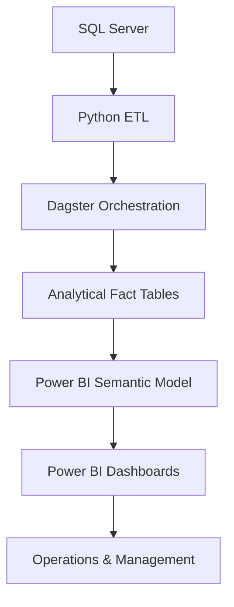
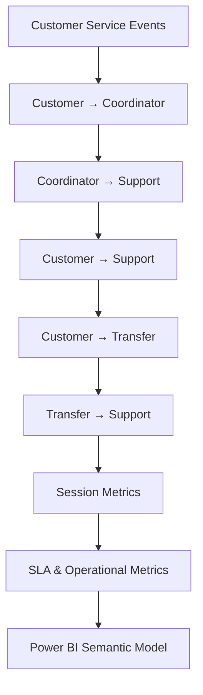

# Customer Service Analytics Platform

An end-to-end Business Intelligence platform for monitoring customer service operations, SLA compliance, response times, and agent performance through automated ETL pipelines, centralized Power BI semantic models, and operational dashboards.

> **Portfolio Note:** Production credentials, internal database objects, proprietary SQL, customer/employee identifiers, and sensitive business logic have been removed or generalized for confidentiality purposes. The repository demonstrates the architecture, engineering patterns, and analytical approach used in the production solution.

---

## Overview

The Customer Service Analytics Platform integrates customer service interactions, assignment events, response times, session metrics, and operational KPIs into a centralized analytics layer.

Daily Python ETL pipelines process operational data, while Dagster orchestrates the workflow and manages execution dependencies. The resulting datasets are consumed by Power BI semantic models and dashboards for operational monitoring and management reporting.

The portfolio version focuses on the underlying analytics architecture and engineering patterns rather than exposing production-specific data or SQL logic.

---

## Business Problem

Customer Service teams required a centralized analytics solution to monitor:

* SLA compliance
* First response time
* Assignment and waiting time
* Agent productivity
* Team performance
* Customer service operational KPIs

Previously, operational reporting relied on fragmented datasets and manual processes, making it difficult to consistently monitor SLA breaches, analyze response performance, and provide standardized management reporting.

---

## Solution

Developed an end-to-end analytics platform combining:

* SQL Server for operational data storage
* Python for ETL and transformation
* Dagster for pipeline orchestration
* Power BI semantic models for analytical modeling
* DAX for reusable business metrics
* Power BI dashboards for operational and management reporting

The ETL layer transforms customer service events into reusable analytical datasets covering response steps, session metrics, transfers, SLA performance, and operational KPIs.

---

## Architecture

### ETL Workflow

---

## ETL Pipeline

The daily ETL workflow is organized into modular transformation steps:

| ETL Step                 | Purpose                                            |
| ------------------------ | -------------------------------------------------- |
| Customer → Coordinator   | Measure initial response performance               |
| Coordinator → Support    | Measure downstream response time                   |
| Customer → Support       | Analyze direct support response                    |
| Customer → Transfer      | Track customer transfer events                     |
| Transfer → Support       | Measure post-transfer response                     |
| Session Waiting Duration | Calculate customer waiting time                    |
| Session Start / End      | Derive session-level duration metrics              |
| End-to-End               | Consolidate response intervals                     |
| Night Session Statistics | Analyze sessions crossing operational time windows |
| All Steps                | Consolidate response and transfer metrics          |

Production-specific SQL and table names are intentionally generalized in this repository.

---

## Semantic Model

The Power BI semantic model centralizes operational metrics used across customer service reporting.

| Metric             | Value |
| ------------------ | ----: |
| Tables             |    32 |
| Measures           |   155 |
| Main Measure Table |   136 |
| KPI Measures       |    19 |

The semantic model provides reusable DAX measures for SLA monitoring, response-time analysis, session metrics, and agent performance.

---

## Business Impact

* Supported operational reporting for more than 100 customer service agents.
* Delivered analytics across 4 customer service teams.
* Maintained weekly and monthly SLA compliance above 99%.
* Automated daily KPI reporting through scheduled ETL pipelines.
* Reduced manual reporting by consolidating operational metrics into centralized dashboards.

---

## Key Responsibilities

* Designed and maintained Power BI semantic models for customer service analytics.
* Developed SQL transformations supporting operational analytical datasets.
* Built reusable DAX measures for SLA and operational KPI reporting.
* Developed modular Python ETL pipelines for daily data processing.
* Automated ETL workflows using Dagster.
* Implemented session-level response and waiting-time calculations.
* Built dashboards for agents, team leaders, and management.
* Monitored data quality and reporting reliability.

---

## Technology Stack

### Data Platform

* SQL Server

### Data Engineering

* Python
* Pandas
* PyODBC
* SQLAlchemy
* Dagster

### Business Intelligence

* Power BI
* Power BI Semantic Models
* DAX

---

## Data Privacy & Portfolio Scope

This repository is a sanitized representation of a production analytics solution.

The following have been removed or generalized:

* Production database credentials
* Server and database names
* Internal schemas and table names
* Customer identifiers
* Employee identifiers and email addresses
* Production SQL queries containing proprietary business logic
* Sensitive operational rules

Representative SQL and generalized ETL logic are provided where appropriate to demonstrate the technical approach without exposing confidential information.

---

## Project Highlights

### Data Engineering

* Modular Python ETL architecture
* Incremental date-based processing
* SQL Server data extraction
* Session-level event transformation
* Response-time and SLA calculations
* ETL logging and error handling

### Orchestration

* Dagster-based pipeline orchestration
* Sequential ETL dependencies
* Daily pipeline execution
* Backfill support
* Modular ETL assets

### Business Intelligence

* Centralized Power BI semantic model
* Reusable DAX measures
* SLA monitoring
* Agent and team performance analytics
* Operational KPI dashboards
