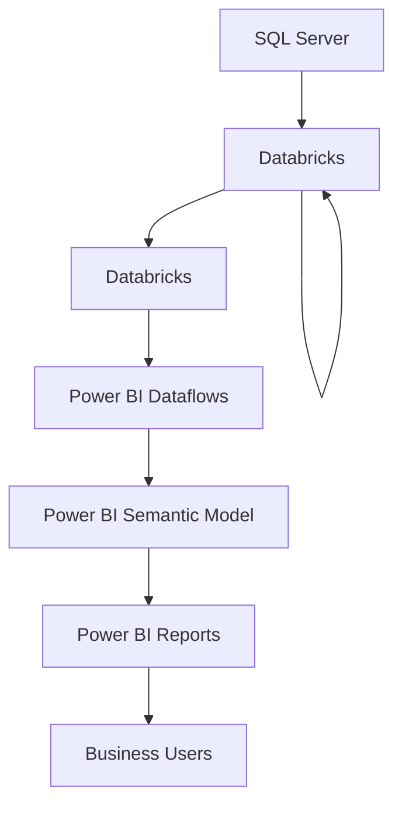

# Enterprise Sales Analytics Platform

Enterprise Business Intelligence platform supporting executive decision-making across Pharmacy & Healthcare E-Commerce through enterprise-scale Power BI analytics.

## Overview

Designed and maintained an enterprise Sales Analytics Platform supporting Pharmacy & Healthcare operations at FPT Retail – Long Châu.

The platform consolidates sales transactions, promotions, payment methods, customer behavior, and operational KPIs into centralized Power BI Semantic Models and executive dashboards, enabling data-driven decision-making across E-Commerce, Operations, Customer Service, and Management teams.

Supporting approximately **100K+ daily sales transactions**, the platform serves **100+ business users** and powers enterprise reporting across multiple business functions.

---

## Business Problem

The business required a centralized analytics platform capable of integrating data from multiple enterprise systems into a single source of truth.

Existing reporting relied on fragmented datasets, lengthy refresh cycles, and disconnected reports, limiting operational visibility and executive decision-making. The platform also needed scalable semantic models capable of supporting large datasets while maintaining reliable daily refresh performance.

---

## Solution

Developed an enterprise analytics platform using **SQL Server, Azure Synapse Analytics, Databricks, Python, Power BI Dataflows, and Power BI Semantic Models**.

The solution delivers:

- Executive sales performance dashboards
- Sales KPI and target monitoring
- Promotion effectiveness analysis
- Payment channel analytics
- Customer purchasing behavior analysis
- Product performance monitoring
- Operational reporting for business stakeholders

---

## Architecture

---

## Semantic Model

| Metric | Value |
|---------|------:|
| Tables | 47 |
| Relationships | 77 |
| Measures | 477 |
| Daily Transactions | 100K+ |
| Business Users | 100+ |
| Refresh Frequency | Daily |

---

## Business Domains

The semantic model supports enterprise reporting across:

- Sales Analytics
- Customer Analytics
- Product Analytics
- Promotion Analytics
- Payment Analytics
- Customer Service Analytics
- Store Performance
- Executive KPI Reporting

---

## Business Impact

- Supported analytics for **100K+ daily sales transactions**.
- Delivered enterprise reporting for **100+ business users** across E-Commerce, Operations, Customer Service, and Management.
- Increased **call center revenue by 15%** through customer repurchase analytics.
- Reduced **Power BI Semantic Model refresh time** from **90 minutes to 30 minutes**.
- Reduced **Power BI Dataflow refresh time** from **3 hours to 1.5 hours**.
- Reduced **semantic model storage** from **15 GB to 5 GB**, eliminating recurring capacity and memory constraints.

---

## Technology Stack

### Data Platforms
- SQL Server
- Azure Synapse Analytics
- Databricks

### Business Intelligence
- Power BI
- Power BI Dataflows
- Power BI Semantic Models
- DAX

### Data Engineering
- Python

---

## Key Responsibilities

- Designed, developed, and optimized enterprise Power BI Semantic Models.
- Built analytical datasets supporting executive reporting and operational analytics.
- Developed KPI frameworks for sales performance monitoring.
- Maintained production reporting pipelines and ensured data quality.
- Optimized reporting architecture, refresh performance, and semantic model scalability.

---

## Project Scope

- Enterprise Business Intelligence
- Sales Analytics
- Customer Analytics
- Promotion Analytics
- Payment Analytics
- Semantic Model Design
- Power BI Performance Optimization
- KPI Framework Development
- Reporting Automation
