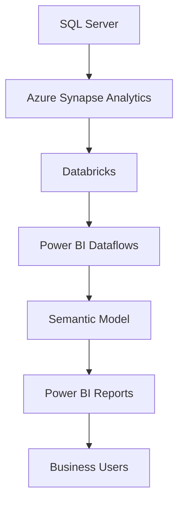

# Enterprise Sales Analytics Platform

Enterprise Business Intelligence platform supporting executive decision-making across Pharmacy & Healthcare E-Commerce through enterprise-scale Power BI analytics.

# Overview

Designed and maintained an enterprise Sales Analytics Platform supporting Pharmacy & Healthcare E-Commerce operations at FPT Retail – Long Châu.

The platform integrates sales transactions, promotions, payment methods, and customer behavior into executive Power BI dashboards, enabling data-driven decision-making across E-Commerce, Operations, and Management teams.

The platform integrates sales transactions, promotions, payment methods, customer behavior, and operational KPIs into centralized Power BI semantic models and executive dashboards, enabling data-driven decision-making across E-Commerce, Operations, and Management teams.

## Business Problem

The business required a centralized analytics platform capable of consolidating sales transactions, promotions, payment methods, customer behavior, and operational metrics from multiple enterprise data sources.

Existing reporting processes relied on fragmented datasets, lengthy refresh cycles, and disconnected reports, limiting timely operational monitoring and executive decision-making.

The solution also required enterprise-scale semantic models capable of supporting large datasets while maintaining reliable daily refresh performance.

## Solution

Developed an enterprise analytics platform using SQL Server, Azure Synapse Analytics, Databricks, Python, and Power BI Dataflows to build reusable semantic models supporting executive reporting and operational analytics.

The platform delivers:
- Executive sales performance dashboards
- Sales KPI and target monitoring
- Promotion effectiveness analysis
- Payment channel analytics
- Customer purchasing behavior analysis
- Product performance monitoring
- Operational reporting for business stakeholders

## Architecture

SQL Server
        │
Azure Synapse
        │
Databricks
        │
Power BI Dataflows
        │
Semantic Model
        │
Power BI Reports
        │
Business Users

## Semantic Model Overview

| Metric | Value |
|---------|------:|
| Tables | 47 |
| Relationships | 77 |
| Measures | 477 |
| Daily Transactions | 100K+ |
| Business Users | 100+ |
| Refresh Frequency | Daily |

## Business Domains

The semantic model supports enterprise analytics across multiple business functions:

- Sales Analytics
- Product Analytics
- Promotion Analytics
- Payment Analytics
- Customer Analytics
- Store Performance
- Customer Service Analytics
- Executive KPI Reporting
  
## Business Impact

- Supported analytics for approximately 100K+ daily sales transactions.
- Served more than 100 business users across E-Commerce, Operations, Customer Service, and Management.
- Increased call center revenue by 15% through customer repurchase analytics.
- Reduced semantic model refresh time from 90 minutes to 30 minutes.
- Reduced Power BI Dataflow refresh time from 3 hours to 1.5 hours.
- Reduced semantic model storage from 15 GB to 5 GB.

## Technology Stack

### Data Platforms
- SQL Server
- Azure Synapse Analytics
- Databricks

### Business Intelligence
- Power BI
- Power BI Dataflows
- Semantic Models
- DAX

### Data Engineering
- Python

## Key Responsibilities

- Designed, developed, and optimized enterprise Power BI semantic models supporting executive reporting.- Developed analytical datasets supporting executive reporting.
- Built KPI frameworks for sales performance monitoring.
- Maintained production reporting pipelines and data quality.
- Optimized enterprise reporting performance and refresh architecture.

## Project Scope

- Enterprise Power BI reporting
- Sales performance analytics
- Customer behavior analytics
- Promotion analytics
- Semantic model optimization
- KPI framework development
- Production reporting automation
